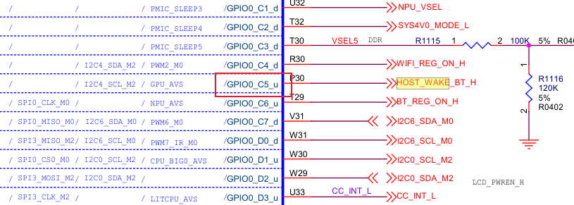
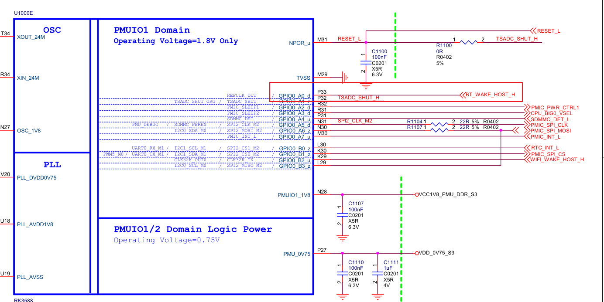

# WIFI驱动移植

#### 一、原理图


##### 1.1、基本引脚解读：

WiFi：SDIO：cmd，data0-3

BT：UART：tx/rs, rts(require to send),  cts(clear to send)

HOST_BT_WAKE：GPIO0_C5_u



BT_WAKE_HOST：GPIO0_A0_d



WL_HOST_WAKE：GPIO0_B2_u

因此，WIFI和BT接口汇总：

```txt
WiFi：SDIO：cmd，data0-3
BT：UART：tx/rs, rts(require to send),  cts(clear to send)
HOST_BT_WAKE：GPIO0_C5_u
BT_WAKE_HOST：GPIO0_A0_d
WL_HOST_WAKE：GPIO0_B2_u
```

‍

#### 二、源代码

##### 2.1、代码结构

**firmware：**

主要功能是实现802.11协议，最终会转化成以太网数据，也就是802.3的数据帧

**driver：**

sdio（wlan.ko没有开放源代码）：

<span data-type="text" style="white-space:pre">	</span>介绍以西sdio驱动的编写 --- sdiodrv、sdioadapter、adiobusdrv

<span data-type="text" style="white-space:pre">	</span>sdiodrv --- 他是driver中sdio与kernel中mmc sdio的接口

<span data-type="text" style="white-space:pre">	</span>sdiobusdrv --- sdio与wifi模块的接口

**iwconfig，iwlist ---**

<span data-type="text" style="white-space:pre">	</span>这两个是linux标准的无限配置命令

2.2、WIFI驱动代码结构

\kernel\net\rfkill\rfkill-wlan.c    --- wlan 驱动初始化

\kernel\net\rfkill\rfkill-bt.c    --- bt 驱动初始化

\kernel\net\rfkill\rfkill-gpio.c    --- gpio 驱动初始化

**Bluez：**

蓝牙协议栈

‍

#### 三、DTS讲解

WIFI:

```txt
&sdio {
    max-frequency = <150000000>;
    no-sd;
    no-mmc;
    bus-width = <4>;
    disable-wp;
    cap-sd-highspeed;
    cap-sdio-irq;
    keep-power-in-suspend;
    mmc-pwrseq = <&sdio_pwrseq>;
    non-removable;
    pinctrl-names = "default";
    pinctrl-0 = <&sdiom0_pins>;
    sd-uhs-sdr104;
    
    // ✅ 尝试使用这些已存在的电源
    vmmc-supply = <&vcc_3v3_s3>;    // 或 <&vcc3v3_pcie30>
    vqmmc-supply = <&vcc_1v8_s3>;
    
    #address-cells = <1>;
    #size-cells = <0>;
    status = "okay";
    
    brcmf: wifi@1 {
        reg = <1>;
        compatible = "brcm,bcm4329-fmac";
        interrupt-parent = <&gpio0>;
        interrupts = <RK_PB2 IRQ_TYPE_LEVEL_HIGH>;
        interrupt-names = "host-wake";
    };
};
```

‍

```txt
&pinctrl {
	... ...

	sdio-pwrseq {
		wifi_enable_h: wifi-enable-h {
			rockchip,pins = <0 RK_PC4 RK_FUNC_GPIO &pcfg_pull_up>;
		};
	};

	... ...

	wireless-bluetooth {
		uart9_gpios: uart9-gpios {
			rockchip,pins = <4 RK_PC4 RK_FUNC_GPIO &pcfg_pull_none>;
		};

		bt_reset_gpio: bt-reset-gpio {
			rockchip,pins = <0 RK_PC6 RK_FUNC_GPIO &pcfg_pull_none>;
		};

		bt_wake_gpio: bt-wake-gpio {
			rockchip,pins = <0 RK_PC5 RK_FUNC_GPIO &pcfg_pull_none>;
		};

		bt_irq_gpio: bt-irq-gpio {
			rockchip,pins = <0 RK_PA0 RK_FUNC_GPIO &pcfg_pull_none>;
		};
	};

	wireless-wlan {
		wifi_host_wake_irq: wifi-host-wake-irq {
			rockchip,pins = <0 RK_PB2 RK_FUNC_GPIO &pcfg_pull_down>;
		};

		// ✅ 恢复这个配置
		wifi_poweren_gpio: wifi-poweren-gpio {
			rockchip,pins = <0 RK_PC4 RK_FUNC_GPIO &pcfg_pull_up>;
		};
	};

	... ...
};
```

‍

```txt
/ {
	/* If hdmirx node is disabled, delete the reserved-memory node here. */
	reserved-memory {
		#address-cells = <2>;
		#size-cells = <2>;
		ranges;

	... ...

	wireless_bluetooth: wireless-bluetooth {
		compatible = "bluetooth-platdata";
		//clocks = <&hym8563>;
		clocks = <&rtc32k>;
		clock-names = "ext_clock";
		uart_rts_gpios = <&gpio4 RK_PC4 GPIO_ACTIVE_LOW>;
		pinctrl-names = "default", "rts_gpio";
		pinctrl-0 = <&uart9m0_rtsn>, <&bt_reset_gpio>, <&bt_wake_gpio>, <&bt_irq_gpio>;
		pinctrl-1 = <&uart9_gpios>;
		BT,reset_gpio    = <&gpio0 RK_PC6 GPIO_ACTIVE_HIGH>;
		BT,wake_gpio     = <&gpio0 RK_PC5 GPIO_ACTIVE_HIGH>;
		BT,wake_host_irq = <&gpio0 RK_PA0 GPIO_ACTIVE_HIGH>;
		status = "okay";
	};

	wireless_wlan: wireless-wlan {
		compatible = "wlan-platdata";
		clocks = <&rtc32k>;
		clock-names = "ext_clock";
		wifi_chip_type = "ap6256";
		pinctrl-names = "default";
		// pinctrl-0 = <&wifi_host_wake_irq>, <&wifi_poweren_gpio>;
		WIFI,host_wake_irq = <&gpio0 RK_PB2 GPIO_ACTIVE_HIGH>;  // GPIO0_B2
		WIFI,poweren_gpio = <&gpio0 RK_PC4 GPIO_ACTIVE_HIGH>;   // GPIO0_C4
		status = "okay";
	};
```
